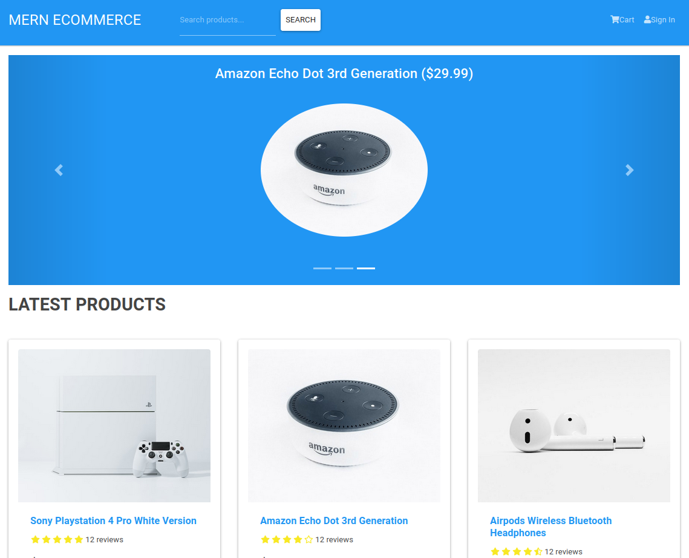

# E-Commerce

## [Live Preview](https://merncommercedny.herokuapp.com/)

E-Commerce application made with React, Redux, Node, Express & MondoDB. Some of the build in functionality are

- Full featured shopping cart
- Product reviews and ratings
- Top products carousel
- Product pagination
- Product search feature
- User profile with orders
- Admin product management
- Admin user management
- Admin Order details page
- Mark orders as delivered option
- Checkout process (shipping, payment method, etc)
- PayPal / credit card integration
- Custom database seeder script

Some of the libraries and tech used are

- React with Functional Components & Hooks
- React router
- React-Bootstrap UI library
- How to structure components
- Component level state & props
- Managing global state with Redux (Actions & Reducers)
- Using Redux state in components (useDispatch & useSelector)
- Creating an extensive back end with Express
- Working with a MongoDB database and the Mongoose ODM
- JWT authentication (JSON web tokens)
- Creating custom authentication middleware
- Custom error handler
- Integrating the PayPal API
- Environment variables
- Project deployment
